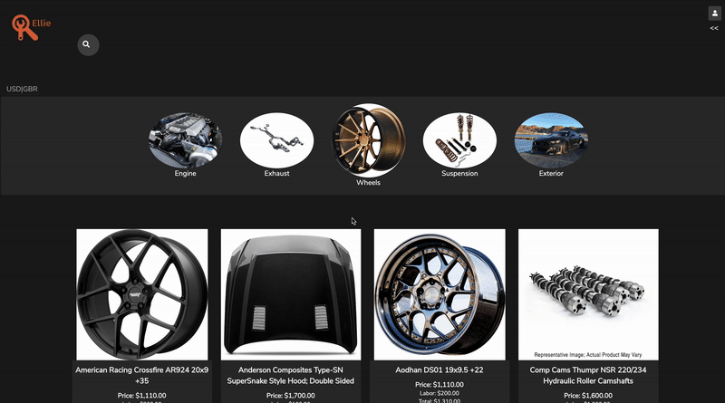
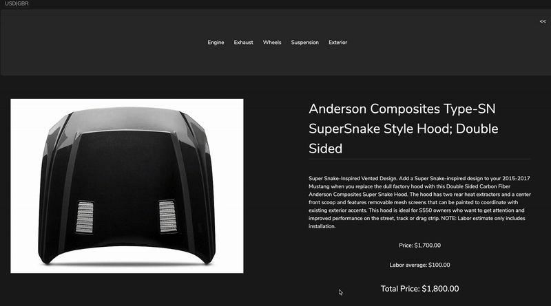

# Ellie

By [Andrew Moss](https://github.com/aMoss5150)

Get an idea what your dream Mustang GT S550 build will cost at [Ellie](https://ellie-deploy.herokuapp.com/)

## Index

##  [Api Documentation](https://github.com/aMoss5150/Ellie-The-Etsy-Clone/wiki/Api-Documentation)
## [Database Schema](https://github.com/aMoss5150/Ellie-The-Etsy-Clone/wiki/Database-Schema)
##  [Front-end Routes](https://github.com/aMoss5150/Ellie-The-Etsy-Clone/wiki/Front-End-Routes)
## [MVP List](https://github.com/aMoss5150/Ellie-The-Etsy-Clone/wiki/MVP-List)
## [User Stories](https://github.com/aMoss5150/Ellie-The-Etsy-Clone/wiki/User-Stories)

## Technologies Used

PERN Stack utilized for this build

- JavaScript
- React/Redux
- Redux Thunk
- Node
- HTML
- CSS
- cors
- morgan
- helmet
- csurf
- cookie-parser
- bcryptjs
- jsonwebtoken
- Express
- Sequelize
- PostgreSQL

## Overview

Ellie is the start of an ongoing app and tool inspired by Etsy and a love for custom car culture and what could have been helpful while making decisions in my own build. The goal: create an easy way to get pricing for your (only Mustang GT S550 at the moment) build with parts and labor estimates all in one place. 

## Simple Minimalist Approach

The goal for this project was to focus on what sort of functionality a consumer would find attractive. I went with a simple elegant dark theme, greys and black with orange accents. The colors as well as the matching logo serve to hint at modern luxury, trying to steer away from car sites that, "get the job done", rather than having a cohesive style. The site is a simple layout consisting of: a home page, product category pages, product details page, mini-cart, build breakdown/cart.

## Mobile first design and responsiveness

A large focus for the appwas to implment a mobile first design, grid display was the most powerful tool in this sense. Grid was utilized at break points to allow changes to the outer level layout of components. If grid was my right hand man, then flex was the left for this project's layout. 

## Local storage

My reasoning behind using JS Local Storage for the cart storage was simple. This app is going to be used to help people find prices for their selected build. With this is mind, it is unreasonable to think that someone would have thousands of parts in their build breakdown. Knowing this, local storage is implemented as simply an array of product ids, with an O(n) complexity, the cart is then built and held in the Redux store, this instead holds all product objects and their full information, keeping local client side storage to a minimum. 

## Mini Cart

The mini cart viewer on the right hand side of the page was a feature that I would appreciate as a user. It allows you to see the product image of each product in your build breakdown/cart at a glance as well as click the image to go straight to the product details page. Essentially, it acts like a shortcut bar to being able to review your products at a glance. The mini cart is available from every page that is not build/breakdown page itself.

## Build Breakdown

The build breakdown is the hub of where you can go to see your build. I decided to keep full product descriptions and conform each product to a smaller product preview, rather than just a picture and a name. The mentality is that this is not as much a cart, as it is more an informational tool allowing you to make informed decisions about your overall build on the spot. 

## Search functionality

Adding in search functionality was also vital to the app and uniquely challenging, using what I know about React, I just went ahead and built the function without using a reference, I find that it is an important exercise to try to rebuild something that is commonly used to allow yourself to run into those problems and gain some lasting knowledge, rather than just following the guided path. It also allows you better understand someone else's reasoning behind why they may have designed something a certain way and I welcome a challenge when it provokes critical thinking in this manner.

## Future Features

-Scraper tool for searching for existing builds that have certain parts already installed
-Sound comparison section with blind shootouts to help decide what exhaust to use
-Would like to expand on sound shootout section that adds volume matching to aid in perception of the tone rather than just volume

